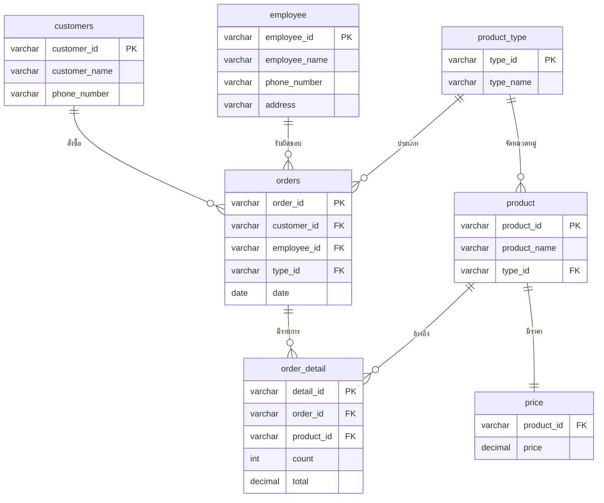

# Second-Hand Goods System — ระบบจัดการฐานข้อมูลรับซื้อของเก่า

โปรเจกต์รายวิชา **Database** — แอปพลิเคชัน Windows Forms (C# / .NET 8) เชื่อมต่อฐานข้อมูล **MySQL** สำหรับจัดการร้านรับซื้อของเก่า ครอบคลุมข้อมูลลูกค้า พนักงาน สินค้า ราคา และคำสั่งซื้อ

## 👥 สมาชิกกลุ่ม
- Cahaya Dewi
- Aaron
- Leob
- Ketut Susilo

## 🛠️ เทคโนโลยีที่ใช้
| ส่วน | รายละเอียด |
|------|-----------|
| ภาษา | C# |
| Framework | .NET 8 (`net8.0-windows`) |
| UI | Windows Forms |
| ฐานข้อมูล | MySQL |
| Connector | MySql.Data 9.3.0 |
| IDE | Visual Studio |

## ✨ ฟีเจอร์
- **จัดการลูกค้า (Customers)** — เพิ่ม / แก้ไข / ลบ / ค้นหา
- **จัดการพนักงาน (Employees)** — เพิ่ม / แก้ไข / ลบ / ค้นหา
- **จัดการประเภทสินค้า (Product Types)** — เพิ่ม / แก้ไข / ลบ
- **จัดการสินค้าและราคา (Products & Price)** — เพิ่ม / แก้ไข / ลบ
- **จัดการคำสั่งซื้อ (Orders)** — บันทึกการรับซื้อพร้อมลูกค้า พนักงาน และวันที่
- **รายละเอียดคำสั่งซื้อ (Order Details)** — ระบุสินค้า จำนวน และยอดรวมในแต่ละออเดอร์

การทำงานทั้งหมดเป็น CRUD ผ่าน `DataGridView` และแสดงผลข้อมูลแบบ JOIN หลายตาราง

## 🗄️ โครงสร้างฐานข้อมูล (ER Diagram)

ฐานข้อมูลชื่อ `project_data_final` ประกอบด้วย 7 ตาราง:



## ⚙️ การติดตั้งและใช้งาน

### สิ่งที่ต้องมี
- Visual Studio 2022 (รองรับ .NET 8)
- MySQL Server
- MySQL Connector/NET 9.3

### ขั้นตอน
1. **สร้างฐานข้อมูล** ชื่อ `project_data_final` บน MySQL แล้วสร้างตารางทั้ง 7 ตามสคีมาด้านบน
2. **ตั้งค่าการเชื่อมต่อ** — ค่าเริ่มต้นในโค้ด (`Form1.cs`):
   ```csharp
   host=localhost;user=root;password=;database=project_data_final
   ```
   ถ้าเครื่องคุณตั้งรหัส MySQL ไว้ ให้แก้ `password=` ให้ตรงกับเครื่องตัวเอง
3. เปิด `UInew.sln` ด้วย Visual Studio
4. กด **Build** แล้ว **Run** (F5)

## 📁 โครงสร้างโปรเจกต์
```
UInew.sln            # Solution ของ Visual Studio
UInew/               # โปรเจกต์หลัก
  Form1.cs           # ฟอร์มหลักและ logic การเชื่อม DB (CRUD ทุกตาราง)
  Form1.Designer.cs  # โค้ดออกแบบ UI (auto-generated)
  Program.cs         # จุดเริ่มต้นโปรแกรม
  Properties/        # Resources และการตั้งค่า
docs/                # เอกสารประกอบ
  *.pdf              # รายงานโปรเจกต์ (เก็บผ่าน Git LFS)
```

## 📄 เอกสารประกอบ
รายงานฉบับเต็มอยู่ในโฟลเดอร์ [`docs/`](docs/) (เก็บผ่าน Git LFS)

---
โปรเจกต์นี้จัดทำเพื่อการศึกษาในรายวิชา Database
